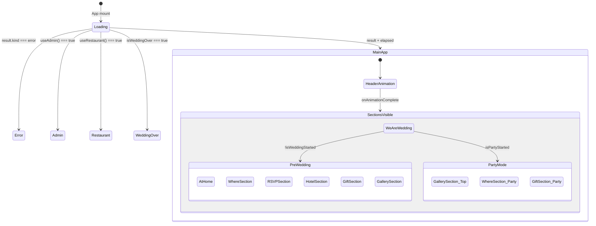
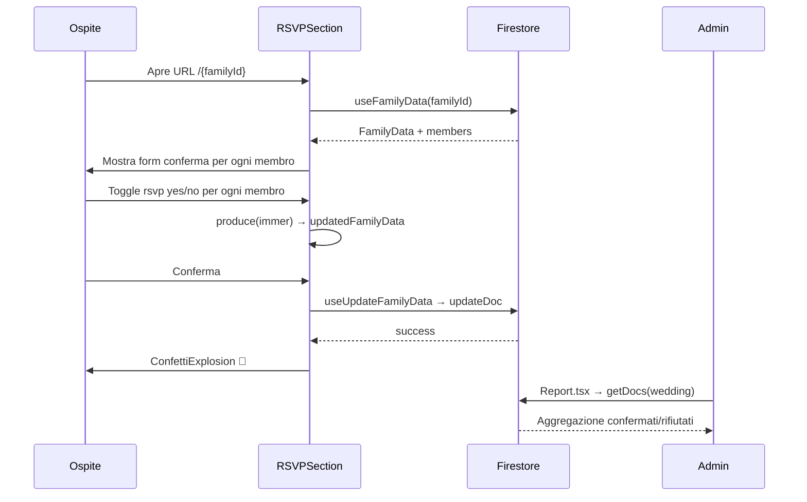

# SKILL.md — State Machine & Diagrams

## Trigger

Attivare quando l'utente chiede: diagramma di stato, flusso, analisi stati, state machine, mermaid, sequenza.

## Protocollo

### Analisi stato applicazione
1. Identificare tutti gli stati (Jotai atoms + useState + condizioni in App.tsx)
2. Identificare le transizioni (eventi utente, timer, Firebase update)
3. Produrre diagramma Mermaid

### Diagramma principale dell'app

### Diagramma RSVP flow

### Output richiesto

Quando si genera un diagramma:
1. Produrre codice Mermaid valido (testabile su mermaid.live)
2. Spiegare ogni stato e transizione
3. Identificare edge case o stati non gestiti
